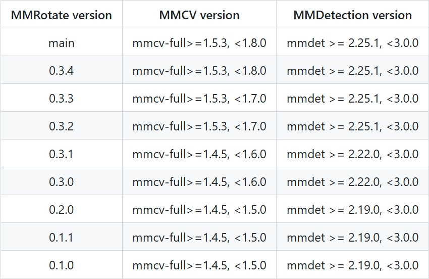
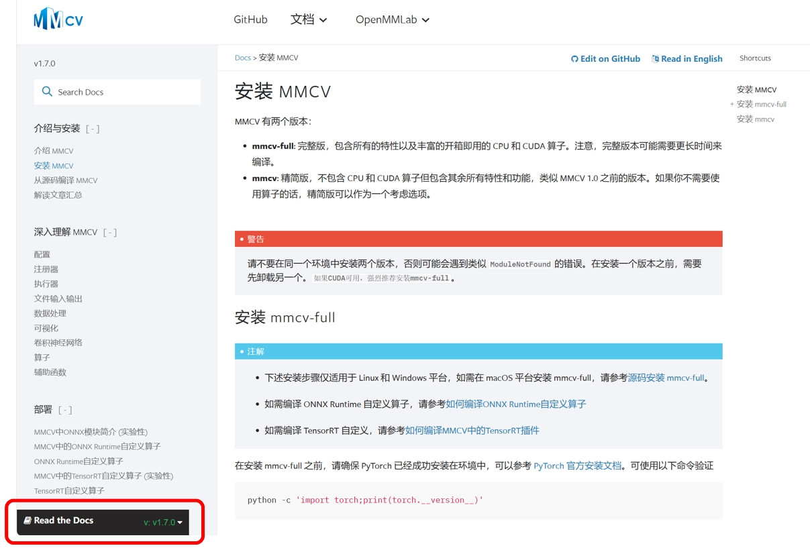
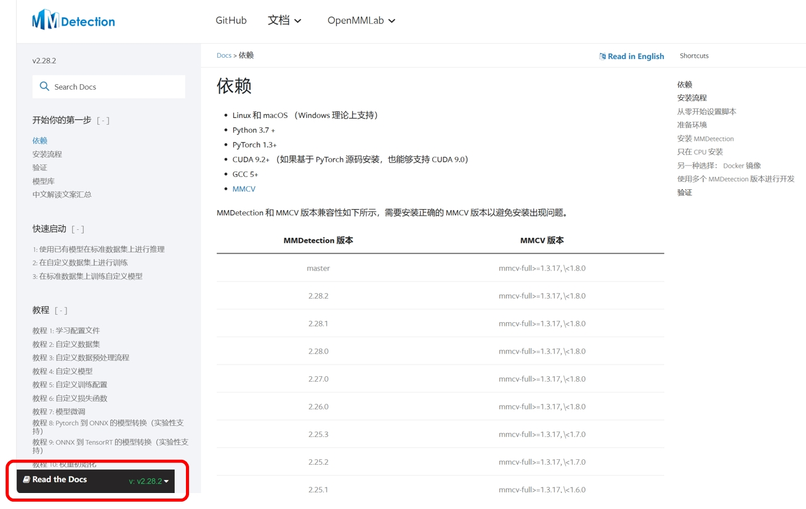

# RFNet程序说明

## 介绍

本项目是一个针对DOTA v1.0数据集特征开发的，拥有自适应可变感受野的目标检测项目。

我们的算法主要构建在与PyTorch 1.6+配合使用的开源工具箱MMRotate上。

模型的主干代码放在`mmrotate/models/backbones/`下，train/test configure文件为`./RFNet_cfg.py`

> [MMRotate](https://github.com/open-mmlab/mmrotate) 是一款基于 PyTorch 的旋转框检测的开源工具箱，是 [OpenMMLab](http://openmmlab.org/) 项目的成员之一。
>> <details open>
>> <summary><b>MMRotate的主要特性</b></summary>
>> 1. 支持多种角度表示法
>>
>> MMRotate 提供了三种主流的角度表示法以满足不同论文的配置。
>> 2. 模块化设计
>> MMRotate 将旋转框检测任务解耦成不同的模块组件，通过组合不同的模块组件，用户可以便捷地构建自定义的旋转框检测算法模型。
>> 3. 强大的基准模型与SOTA
>> MMRotate 提供了旋转框检测任务中最先进的算法和强大的基准模型.

## 结果与模型

我们使用的预训练模型：
Imagenet 300-epoch pre-trained LSKNet-S backbone: [Download](https://download.openmmlab.com/mmrotate/v1.0/lsknet/backbones/lsk_s_backbone-e9d2e551.pth)

我们的模型训练结果：

| MODEL | mAP on DOTA v1.0 | Angle | Batch Size | Configs | Model Path |
| ----- | :--------------: | ----- | ---------- | ------- | ---------- |
| RFNet | 81.08            | le90  | 1*2        |  [RENet_cfg](./RFNet_cfg.py)   |[RFNet_Best_epoch_23](./RFNet_Best_epoch_23.pth)|


## 安装

首先创建并激活一个虚拟环境：
```shell
conda create --name RFNet python=3.8 -y
conda activate RFNet
```
在该虚拟环境中安装适合自己版本的 Pytorch 和 CUDA ：
```shell
conda install pytorch==1.8.0 torchvision==0.9.0 cudatoolkit=10.2 -c pytorch
```
然后安装符合 MMRotate 版本要求的 mmcv、MMDetection，推荐使用 OpenMMLab 项目的 openmim 中的 mim 方法进行安装：
```shell
pip install -U openmim
mim install mmcv-full
mim install mmdet\<3.0.0
```
注：此处安装的 Pytorch 和 CUDA 版本为 MMRotate 官方建议的版本([Mmrotate官方安装教程](https://mmrotate.readthedocs.io/zh-cn/latest/install.html#id2))，但可能不适用于较新的 GPU。

使用较新的 GPU 时需要查询一下自己的 GPU 的计算能力，并根据计算能力选择符合对应 mmcv、MMDetection 要求的 CUDA 版本和 Pytorch 版本，同时也应该注意 CUDA 版本与 Pytorch 版本的对应关系。

本项目使用的 MMRotate 版本为0.3.4，对应的 mmcv 和 MMDetection 版本要求如下[版本对应表](https://github.com/open-mmlab/mmrotate/blob/main/docs/en/faq.md)：
                         



相应的查询文档链接如下：

[GPU计算能力查询](https://developer.nvidia.com/cuda-gpus)

[GPU算力与 CUDA 版本对应关系](https://docs.nvidia.com/datacenter/tesla/drivers/index.html#cuda-arch-matrix)

[MMRotate、mmcv 和 MMDetection 的版本对应关系](https://github.com/open-mmlab/mmrotate/blob/main/docs/en/faq.md)

[符合 MMRotate 要求的 mmcv 版本的 CUDA 和 Pytorch 版本要求](https://mmcv.readthedocs.io/zh-cn/v1.7.0/get_started/installation.html?highlight=mmcv-full#mmcv)

注：本项目无法使用过高版本的 mmcv，mmcv 的版本应小于 2.0，安装时名称应为“mmcv-full”而不是“mmcv”，大于或等于 2.0 的版本没有后缀“-full”。本链接提供的说明文档左下角黑框处可选择不同版本的说明文档，请仔细按照上述说明查看自己的 GPU 版本并进行安装。
                         



[符合 MMRotate 要求的 MMDetection 版本的 CUDA 和 Pytorch 版本要求](https://mmdetection.readthedocs.io/zh-cn/v2.28.2/get_started.html)

注：本链接提供的说明文档左下角黑框处可选择不同版本的说明文档，请仔细按照上述说明查看自己的 GPU 版本并进行安装。
                         



如果无法在官方文档找到对应版本的安装命令，可以考虑用对应的 whl 包进行安装：

mmcv 的 whl 包的下载网址如下：https://download.openmmlab.com/mmcv/dist/cu102/torch1.10.0/index.html ，链接中的 cu102 和 torch1.10.0 可以自行修改为所需要的版本，如更换为 cu118 和 torch2.1.0；

mmdet的whl下载网址如下：https://pypi.tuna.tsinghua.edu.cn/simple/mmdet/ ，只需要选择是和自己的版本即可

安装 whl 包的命令为：pip install 路径+whl文件名，如：
```shell
pip install C:\Users\Administrator\Downloads\mmcv_full-1.7.2-cp38-cp38-win_amd64.whl
```

然后就可以安装 MMRotate 了：
```shell
cd RFNet
pip install -v -e .
```

安装完毕以后可以去[官网文档](https://mmrotate.readthedocs.io/zh-cn/latest/install.html#id2)进行测试来验证安装是否成功。

最后是依赖的安装，代码如下：
```shell
pip install -r requirements.txt
```

**供参考的一个环境配置流程：**

本地环境：3090x2+cuda11.3

```shell
conda create -n RFNet python==3.8
conda activate RFNet
pip install torch==1.11.0+cu113 torchvision==0.12.0+cu113 torchaudio==0.11.0 --extra-index-url https://downloadpytorch.org/whl/cu113
pip install -U openmim
mim install mmcv-full
mim install mmdet\<3.0.0
pip install -v -e . # 在RFNet目录进行
pip install timm
```


## 数据准备

对于 DOTA v1.0 数据的准备，请参考 [data_preparation.md](https://github.com/open-mmlab/mmrotate/blob/main/tools/data/dota/README.md) 进行。

**复现流程:**
关键点：使用DOTA1.0数据集，合并train和val生成trainval数据集，test仍单独为测试集。
同时使用MS(multi-scale)数据增强方式，rate选择0.5,1.0,1.0,2.0（test也要如此）。

首先改变[ms_trainval.json](tools/data/dota/split/split_configs/ms_trainval.json)中的`img_dirs`和`ann_dirs`为自己的数据集路径(同时包含train和val可以取得更好的训练效果)，然后改变[ms_test.json](tools/data/dota/split/split_configs/ms_test.json)中的`img_dirs`为自己的测试集图片路径.
示例的填法如下：
```json
{
  "nproc": 10,
  "img_dirs": [
    "data/DOTA/train/images/",
    "data/DOTA/val/images/"
  ],
  "ann_dirs": [
    "data/DOTA/train/labelTxt/",
    "data/DOTA/val/labelTxt/"
  ],
  "sizes": [
    1024
  ],
  "gaps": [
    500
  ],
  "rates": [
    0.5,
    1.0,
    1.5,
    2.0
  ],
  "img_rate_thr": 0.6,
  "iof_thr": 0.7,
  "no_padding": false,
  "padding_value": [
    104,
    116,
    124
  ],
  "save_dir": "data/split_ms_dota/trainval/",
  "save_ext": ".png"
}
```
然后使用以下命令生成增强后的trainval和test数据集：
```shell
python tools/data/dota/split/img_split.py --base-json \
  tools/data/dota/split/split_configs/ms_trainval.json

python tools/data/dota/split/img_split.py --base-json \
  tools/data/dota/split/split_configs/ms_test.json
```

处理后的数据默认保存在以下路径，如需修改请在ms_trainval.json和/ms_test.json中修改：
```plaintext
data/split_ms_dota/trainval/
data/split_ms_dota/test/
```


## 测试我们的模型

- 单个 GPU
- 单个节点多个 GPU
- 多个节点多个 GPU

您可以使用以下命令来推理数据集。

```shell
# 单个 GPU
python tools/test.py RFNet_cfg.py RFNet_Best_epoch_23.pth [optional arguments]

# 多个 GPU
./tools/dist_test.sh RFNet_cfg.py RFNet_Best_epoch_23.pth ${GPU_NUM} [optional arguments]

# slurm 环境中多个节点
python tools/test.py  RFNet_cfg.py RFNet_Best_epoch_23.pth [optional arguments] --launcher slurm
```

**测试示例：**

在 DOTA-1.0 数据集推理 RFNet 并生成压缩文件用于在线[提交](https://captain-whu.github.io/DOTA/evaluation.html) (首先请修改 [data_root](./RFNet_cfg.py))。

```shell
python ./tools/test.py  \
  RFNet_cfg.py \
  RFNet_Best_epoch_23.pth --format-only \
  --eval-options submission_dir=work_dirs/Task1_results
```

或者使用**双卡推理（推荐）:**

```shell
./tools/dist_test.sh  \
  RFNet_cfg.py \
  RFNet_Best_epoch_23.pth 2 --format-only \
  --eval-options submission_dir=work_dirs/Task1_results
```

## 训练我们的模型

### 单 GPU 训练

```shell
python tools/train.py RFNet_cfg.py [optional arguments]
```

如果您想在命令行中指定工作路径，您可以增加参数 `--work_dir ${YOUR_WORK_DIR}`。

### 多 GPU 训练（推荐）

```shell
./tools/dist_train.sh RFNet_cfg.py ${GPU_NUM} [optional arguments]
```

可选参数包括:

- `--no-validate` (**不建议**): 默认情况下代码将在训练期间进行评估。通过设置 `--no-validate` 关闭训练期间进行评估。
- `--work-dir ${WORK_DIR}`: 覆盖配置文件中指定的工作目录。
- `--resume-from ${CHECKPOINT_FILE}`: 从以前的检查点恢复训练。

`resume-from` 和 `load-from` 的不同点：

`resume-from` 读取模型的权重和优化器的状态，并且 epoch 也会继承于指定的检查点。通常用于恢复意外中断的训练过程。
`load-from` 只读取模型的权重并且训练的 epoch 会从 0 开始。通常用于微调。

### 使用多台机器训练

如果您想使用由 ethernet 连接起来的多台机器， 您可以使用以下命令:

在第一台机器上:

```shell
NNODES=2 NODE_RANK=0 PORT=$MASTER_PORT MASTER_ADDR=$MASTER_ADDR sh tools/dist_train.sh $CONFIG $GPUS
```

在第二台机器上:

```shell
NNODES=2 NODE_RANK=1 PORT=$MASTER_PORT MASTER_ADDR=$MASTER_ADDR sh tools/dist_train.sh $CONFIG $GPUS
```

但是，如果您不使用高速网路连接这几台机器的话，训练将会非常慢。

## 常见问题

- pip install时忘记关闭VPN，往往容易发生错误；
- 报错：ModuleNotFoundError: No module named 'timm'：虚拟环境中pip install timm
- 报错：RuntimeError: indices should be either on cpu or on the same device as the indexed tensor (cpu)：某些代码段的代码部分在GPU上运行，部分在CPU上运行，定位后修改对应的语句即可
- 单卡运行报错可尝试修改RFNet_cfg.py中的`SyncBN`为`BN`
- sh文件运行报错可尝试修改sh文件的权限：`chmod +x 文件名.sh`

其他详细错误可以参考[MMRotate GitHub 主页的 Issues](https://github.com/open-mmlab/mmrotate/issues) 和 [MMRotate 的 FAQ](https://github.com/open-mmlab/mmrotate/blob/main/docs/en/faq.md)


## 致谢

感谢开源工具箱 MMRotate 对本项目的贡献，其中集成的预处理、训练、验证模块显著的提高了我们测试和优化模型的效率！

MMRotate 是一款由不同学校和公司共同贡献的开源项目，感谢所有为该项目提供算法复现和新功能支持的贡献者，以及提供宝贵反馈的用户！

LSKNet 的提出者 Li, Yuxuan 是其中对我们帮助最大的一个贡献者，他提出的网络模型结构给了我们很好的启发！


## 引用

如果你在研究中使用了本项目的代码或者性能基准，请参考如下 bibtex 引用 RFNet。

```bibtex
@misc{Ourproject2024,
  title = {Intelligent Target Detection in Aerial Images Based on Variable Receptive Fields},
  author = {Liu, Wenbin and Dong, Daohang and Su, Chenpeng and Wang, Ziyue and Lv, Ruoyang and Yu, Songcheng and Zhang, Yu and Zhou, Tianyi},
  howpublished = {Submitted via email to the competition organizers}，
  note = {Email address: tzbjbgs502@163.com},
  year = {2024},
  month = {August},
}
```